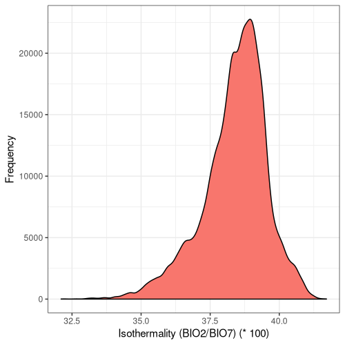

<br/>

# Exploring the distribution of ancient woodland in England

<style>
div.one { background-color:#FFFFFF; border-radius: 5px; padding: 20px; opacity: 0.85;}
</style>

<div class = "one">

## Introduction

Inspired by the work being carried out in the Ancient Woodland inventory project, I decided to do some exploratory analysis and visualisation of the various AW sites in England. Ancient woodland is a relatively understudied ecosystem, though numerous in number of sites with some ~53000 sites just in England, individual sites are extraordinarily small on average. With increasing land-use pressures, fragmentation and habitat degradation, understanding and identifying ancient woodland habitat is paramount. 

I had the following questions before going into the analysis itself:

* What are the average characteristics of individual AW sites?
* Where are the majority of AW sites located in England?
* Where are the most suitable areas for Ancient Woodland, or, where are we most likely to find more Ancient Woodland to identify for the inventory project?

</div>

<br/>

<style>
div.results { background-color:#FFFFFF; border-radius: 5px; padding: 20px; opacity: 0.95;}
</style>
<div class = "results">

## Results and Discussion

### What are the average characteristics of individual AW sites?

The average area (km2) of ancient woodland sites in England is relatively small (6.85 ± 0.077). Further, perimeters (m) of individual sites are relatively large (1309.48 ± 6.82), a potential by-product of severe fragmentation. Taken together, this could potentially result in pronounced edge effects as the effective area of an individual site is reduced by a substantial perimeter with neighboring environments. That said, there are some extraordinarily large ancient woodland sites, with the largest site being 719.43 km2. Most sites, however, are small by area and possess substantial boundaries with surrounding areas (Fig. 1). 


**Figure 1.** Frequency plots for area (a) and perimeter (b) of ancient woodland sites in England. Plots are split according to the x axis scale, with both linear (i) and logarithmic (ii) scales shown. Area data-points were converted to m2 prior to conducting a log10 transform to avoid the inclusion of negative values.  

### Where are the majority of AW sites located in England? {.tabset}

To answer this question I produced three separate maps, each containing a different output format (Fig. 2). From all three, it is clear that the majority of Ancient Woodland is located in the South East and the West Midlands (Fig. 2). There are some additional, smaller hotspots located in the North West, East Midlands and Yorkshire and the Humber. Using the interactive chloropleth (Fig. 2c), we can see where Ancient Woodland is located by city districts. Herefordshire and Wealden contain the most AW sites with both over ~2000 sites each (Fig. 2c).

#### Hexbin


**Figure 2a**. Hexbin plot displaying the distribution of Ancient Woodland in England, overlayed over the corresponding city districts. 

#### K-density & iso-contours


**Figure 2b**. Kernel density and iso-contour plot displaying the distribution of Ancient Woodland in England, overlayed over the corresponding city districts. 

#### Chloropleth

```{r message=FALSE, warning=FALSE, include=FALSE}
library(dplyr)
library(rgdal)
library(leaflet)
library(htmltools)

#---------------------------------- Data prep ---------------------------------------

shp <- readOGR(
  dsn = "~/Desktop/R-projects/GIS-work/Project_2/Data",
  layer = "site_count_districts"
)

counts <- read.csv(file = "~/Desktop/R-projects/GIS-work/Project_2/Data/sites_per_district.csv", h = T)

#Subset and filter shapefile to England 
counts         <- counts[-c(317:382), ]
counts$lad19nm <- as.character(counts$lad19nm)
districts      <- counts$lad19nm
shp            <- shp[shp$lad19nm %in% districts, ]

#------------------------------ Formatting for map ----------------------------------

#Specifying legend scale and colour
bins <- c(0, 20, 50, 100, 200, 500, 1000, 2000, 3000)
pal  <- colorBin("viridis", domain = shp$NUMPOINTS, bins = bins)

#Label formatting
labs <- sprintf(
  "<strong>%s</strong><br/>%g Ancient Woodland sites",
  shp$lad19nm, shp$NUMPOINTS
) %>% lapply(htmltools::HTML)
```

```{r echo=FALSE}
#--------------------------------- Final plot ---------------------------------------

leaflet(shp) %>%
  
  leaflet::addPolygons(
    fillColor = ~pal(NUMPOINTS),
    weight = 2,
    opacity = 1,
    color = " ",
    dashArray = "3",
    fillOpacity = 0.7,
    highlight = highlightOptions(
      weight = 2,
      
      color = "black",
      dashArray = "",
      fillOpacity = 0.7,
      bringToFront = TRUE),
    label = labs,
    labelOptions = labelOptions(
      style = list("font-weight" = "normal", padding = "3px 8px"),
      textsize = "15px",
      direction = "auto")) %>%
  
  leaflet::addLegend(pal = pal, values = ~NUMPOINTS, opacity = 0.7, title = "No. of sites:",
            position = "bottomright")
```
**Figure 2c**. Interactive chloropleth displaying the distribution of Ancient Woodland in England by city district. 

##

### Where are we most likely to find more Ancient Woodland to identify for the inventory project? {.tabset}

One of the primary goals of Ancient Woodland conservation in England is to identify sites for protection which are currently unknown or not listed. Leveraging both the coordinate data from Natural England UK, and the bioclimatic data from WorldClim (Fick and Hijmans, 2017), I produced an index for climatic suitability which could be re-mapped onto England:


**Figure 3**. Climatic suitability for Ancient Woodland in England, based on a deviation index derived from the average of 17 rescaled bioclimatic layers.

With such an index, we can locate areas where Ancient Woodland is most likely to be, based on climatic conditions alone. Interestingly, there are some areas where there is a mis-match between the climatic suitability and the number of AW sites located there (e.g. in Norfolk and Lancashire)(Fig. 3). This could either be a result of other contributing factors or under-sampling in the region. Both are probable and a further review of the literature would be required to understand the weight of such factors, which is outside the scope of this project. 

In addition, I opted to test the accuracy of the final, mean deviation index produced using an arbitrary threshold at a deviation of 0.1 (note this threshold is on the scale of the deviation index itself: 0 - 1). Using [`validate()`](https://github.com/zibbini/minor_projects/blob/master/ancient_woodland/R/fun/validate.R), the accuracy of such a threshold was 47.62%. Such a result is not surprising even if it is at an arbitrary threshold, given that the method employed is rudimentary. A visual representation of the threshold can be found below:


**Figure 4**. Suitable areas for Ancient Woodland at a threshold of 0.1, based on a deviation index derived from the average of 17 rescaled bioclimatic layers.

Please note that this solution is by no means comprehensive and is a simple, first exploration into possible methods for identifying areas where the probability of finding Ancient Woodland is the highest. 

Lastly, I sought to quantify the range of bioclimatic conditions found at AW sites and visualise the result:

#### 1


#### 2


#### 3



#### 4


#### 5


#### 6


#### 7


#### 10


#### 11


#### 12


#### 13


#### 14


#### 15


#### 16


#### 17


#### 18


#### 19


###

**Figure 5**. Frequency distribution plots for each bioclimatic parameter sourced from WorldClim (Fick and Hijmans, 2017). The number for each corresponds to the labelling found on WorldClim.

Some climatic variables contain much tighter distributions with a smaller standard deviation (Fig. 5), suggesting that Ancient Woodland has a relatively small range of climatic conditions it can occur over. This could be due to the abiotic requirements of specific keystone species or the community of species as a whole. Nonetheless, this could mean Ancient Woodland is particularly susceptible to climate change and we could see the loss of much of this endangered habitat in the coming decades. 


## Methods

### Quantifying site characteristics

All analysis for this section was handled by an individual script which you can find [here](https://github.com/zibbini/minor_projects/blob/master/ancient_woodland/R/summary_stats.R). Standard error was quanitified using the following function:

```{r eval=FALSE}
se <- function(x) (sd(x)/sqrt(length(x)))
```

Visualising the frequency distributions was conducted using packages `ggplot2` and `gridExtra`.

### Visualising where AW sites are located

#### Static maps

Data and shapefile preparation was conducted using packages `rgdal`, `proj4` and `ggplot2`. Visualisation of the distributions was carried out using packages `ggplot2`, `ggsn` and `RColorBrewer`. In addition, I wrote a helper function for exporting individul plots: [`plot.save()`](https://github.com/zibbini/minor_projects/blob/master/ancient_woodland/R/fun/plot.save.R). The code used for this section can be found [here](https://github.com/zibbini/minor_projects/blob/master/ancient_woodland/R/static_maps.R).

#### Interactive chloropleth

Quantifying the frequency of AW sites in each individual city district was conducted in QGIS 3.10.0 using the *Count points in polygon* tool. Packages `rgdal` and `dplyr` were used for the final data preparation before producing the map. Packages `htmltools` and `leaflet` were used for visualising the interactive chloropleth . You can find the code for this section [here](https://github.com/zibbini/minor_projects/blob/master/ancient_woodland/R/leaflet_map.R). 

### Bioclimatic analysis

Clipping the WorldClim bioclimatic layers to England was carried out using GDAL, in a bash script which you can find [here](https://github.com/zibbini/minor_projects/blob/master/ancient_woodland/bash/layer_prep.sh). The mask layer was sourced from Natural England UK. 

Quantifying the climate suitability or average deviation index, required extracting values for each bioclimatic layer at the location of chosen point data, followed by mapping a deviation index onto the respective bioclimatic layer based on the mean of the extracted values. Note that extracted values here corresponds to only the extracted values of the specific bioclimatic layer, and not the extracted values of all the bioclimatic layers. Further, due to the relatively low resolution of the bioclimatic layers (1 km<sup>2</sup>) and that they are produced through interpolation, a buffer was not used for extraction. Transforming all the deviation indices to an arbitrary scale of 0 - 1 was required to aggregate all the deviation indices and quantify the average. Producing the individual indices was conducted using a helper function: [`rescale.mean()`](https://github.com/zibbini/minor_projects/blob/master/ancient_woodland/R/fun/rescale.R). 

The analysis for this section was handled using several helper [functions](https://github.com/zibbini/minor_projects/tree/master/ancient_woodland/R/fun) and a final [script](https://github.com/zibbini/minor_projects/blob/master/ancient_woodland/R/bioclim_analysis.R) containing the code used in creating the visualisations. You can find detailed information on the helper functions in their respective documentation. Packages `raster`, `proj4` and `rgdal` were used for spatial data manipulation. Packages `parallel`, `doParallel` and `foreach` were used for parallel computing tasks. Packages `ggplot2` and `ggsn` were used for visualisation purposes. Finally, package `docstring` was used for producing documentation for the helper functions. Bioclimatic data was sourced from WorldClim and GPS coordinate data was sourced from Natural England UK.

## References

Fick, S.E. and R.J. Hijmans, 2017. Worldclim 2: New 1-km spatial resolution climate surfaces for global land areas. International Journal of Climatology.


