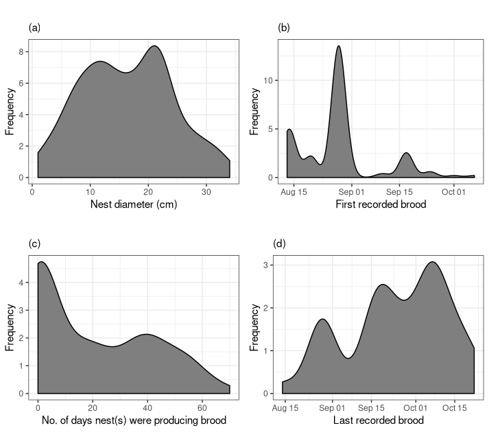
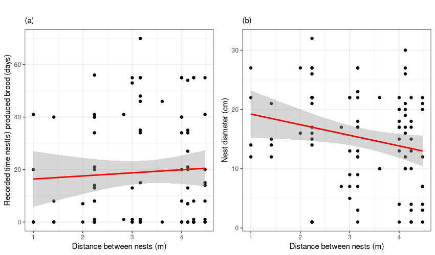
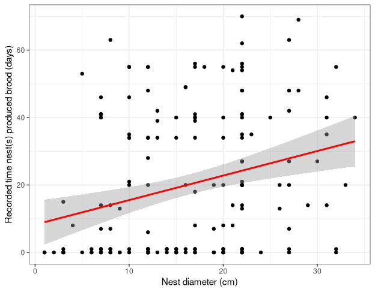

 

# Further analysis into the ecology of *Formica exsecta* at Chudleigh Knighton Heath, Devon

## Introduction

During the course of my undergraduate dissertation, there were some additional questions raised that I did not have the time to answer and so will aim to do so here. This project page is split into several sections, reflecting the sub-projects I wanted to explore. **Section 1** will cover analyses into parameters, either directly measured in situ or that were be quantified after the fact, which were not explored in my dissertation. **Section 2** will cover various additional methods for visualising the daily temperature regimes of the nests of *F. exsecta*, that were also not explored. Finally, **Section 3** will briefly showcase a simple GUI I developed for exploring key nesting characteristics of individual *F. exsecta* nests at the reserve.

 

## Section 1: Analysis of the remaining parameters

The remaining parameters that were not able to be analysed are: individual nest size (diameter in cm), commencement date for brood production, cessation date for brood production, total time individual nests produced brood (days) and finally the distance between individual nests (m). There are a variety of nest sizes present at Chudleigh Knighton Heath, with the majority being small to moderately sized nests (Fig. 1a). There are very few exceptionally large nests, whilst also a number of very small nests that are mostly satellites to larger, polygynous nests (Fig. 1a). *F. exsecta* nests at this reserve also have particularly short windows of brood production (Fig. 1c), with most nests commencing brood production in late August and cessating brood production in early October (Fig. 1b and 1d respectively). 

**Figure 1**. Frequency distribution of various nest parameters: individual nest size (a) and temporal measures of brood production (b - d). Data courtesy of Walters (2018). 

There is some discussion in the literature that relatively small nest sizes (in comparison to other *F. exsecta* populations), may be an indicator of sub-optimal environmental conditions. It would follow that with such a densely populated reserve as Chudleigh Knighton Heath, resource competition may be fierce if environmental conditions are sub-optimal. Especially so if not all of the nests are polygynous, and as a result do not exchange resources and instead are territorial (I have covered this in far more detail in my dissertation which you can find [here]()). Using all the above parameters, I conducted analyses across the ~174 nests at the reserve to quantify if intra-nest distances had any relationship with individual nest size and brood production. 

**Figure 2**. Scatter plots with corresponding regression line and standard error bounds for the relationship between distance between nests and (a) total brood production time and (b) nest diameter. 

Surprisingly, intra-nest distance was significantly, but weakly negatively correlated with individual nest size (r = -0.22, *t* 90 = -2.19, P < 0.05). Conversely, intra-nest distance was only weakly positively correlated with the total brood production time (r = 0.06, *t* 90 = 0.54, P = 0.59). 

**Figure 3**. Scatter plot with corresponding regression line and standard error bounds for the relationship between nest diameter and total brood production time. 

Interestingly, nest diameter was significantly, weakly positively correlated with total brood production time (r = 0.27, *t* 174 = 3.7, P < 0.001). This is most likely a reflection of the data rather than any particular relationship between the parameters. Specifically, nests below 10 cm in diameter in general do not produce brood. As a result, the data is very likely skewed due to this, causing the tests to over-fit. The same can be applied to Fig. 2b, where the abscence of small nests at an intra-nest distance below 2m is likely having the same effect. However, in both circumstances additional intepretations can be drawn, namely that the abscence of data below a specific threshold could convey information about the population itself. In other words, we can speculate that the abscence of small nests (< 10cm) at very low intra-nest distances (< 2m), could be a result of more pronounced competition at smaller intra-nest distances. The presence of small nests at higher intra-nest distances could reflect much lower competition. On the other hand, the fact that only several small nests were observed producing brood for more than 1-2 days, could reflect a constraint on brood production due to nest size. Taken together, these results suggest that conservation efforts such as translocation, should target medium to large nests (> 10 cm) and translocate them to areas where the distance to the closest nest is > 2m. 

## Section 2: Visualising nest temperature of *F. exsecta*

## Methods

