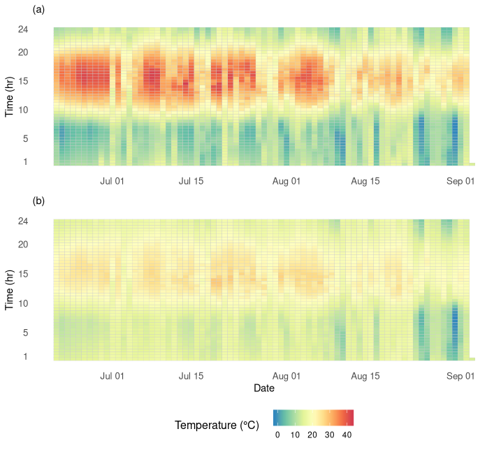
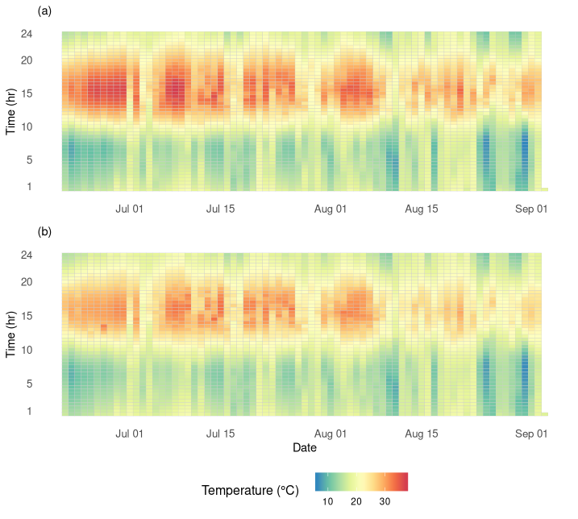

 

## Visualising nest temperature of *F. exsecta* nests 

 

Here I explore a different output format for visualising the daily temperature regimes of *F. exsecta* nests. This project is an extension of my undergraduate [dissertation](https://github.com/zibbini/projectPages/tree/master/additional_assets) and the output formats I used there. The output format I explored was the popular time series heatmap. The first pair of heatmaps represents a single pair of loggers, with the first monitoring the temperature of a single *F. exsecta* nest and the second monitoring the temperature of the soil 1m from the respective nest (Fig. 1). From Fig. 1, we can clearly see the different heating and cooling rates found in *F. exsecta* nests compared to the soil control. 

**Figure 1**. Two time series heatmaps representing monitored temperature over 74 days, for (a) a single *F. exsecta* nest and (b) the corresponding soil control. 

The following pair of heatmaps represents the mean temperature for the monitored nests (n=8) and corresponding soil controls (n=8) (Fig. 2). There is still some differentiation between the temperature found in nests versus soil controls, but the drastic difference found in Fig. 4 is no longer as apparent here. This is simply due to the variability in the data obtained. In a larger sample size, we would expect to see data variability not have such an impact on the average trends.

**Figure 2**. Two time series heatmaps representing mean monitored temperature over 74 days, for (a) *F. exsecta* nests and (b) the corresponding soil controls. 

 

### Methods

Data preparation was carried out using packages `lubridate`, `data.table` and `plyr`. Producing the heatmaps involved the use of packages `ggplot2`, `gridExtra` and `RColorBrewer`. Source code for this project is available [here](https://github.com/zibbini/minor_projects/blob/master/F.exsecta_analysis/R/Heatmaps.R). Data was sourced from my undergraduate [dissertation](https://github.com/zibbini/projectPages/tree/master/additional_assets). 

