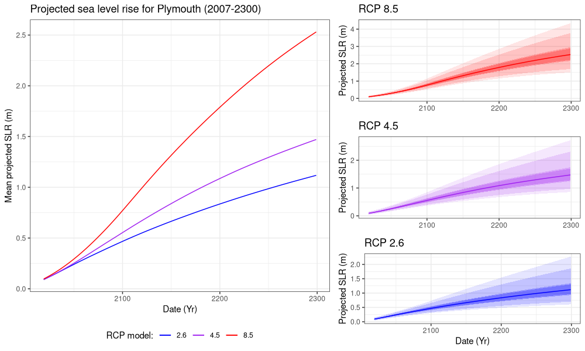

 

# Visualising the impact of future sea level rise on Plymouth and the surrounding areas

With the wide availability of good quality LIDAR data, especially in the UK, visualising sea level changes is relatively easy. I had the following questions before going into the analysis itself:

* What is the projected sea level rise in Plymouth and the surrouding areas?
* How much land will be lost as a result? 

 

### Results

#### Projections

Projections from Met Office based on the most recent models suggest that we can expect between ~1m and ~2.5m by 2300 (Fig. 1). If we take the highest and lowest percentiles of each model, we can expect between ~0.6 and ~4m of sea level rise. Note however, that the predictions that have the most confidence are those from the 50th percentile. Similarly, the confidence of the predictions reduces the further they are from the present. 

**Figure 1**. Projected sea level rise according to the various representative concentration pathways (RCP). Adjacent graphs on the right cover the variability in projections between the percentiles (5th - 95th). Delineation of the percentiles is as follows: 5, 10, 30, 33, 50, 67, 70, 90, 95.

#### Animating the impact

Below are animations corresponding to each RCP model, visualised for 2019 - 2300 for Plymouth and the surrounding areas. By visualising the sea level rise in this format, it becomes quite clear just how much land could be lost over the coming decades and centuries. It is important to bear in mind the steep elevation in many areas in Plymouth. If we applied this same visualisation to a more low-lying and level area, with the corresponding projections, the effects could be much more drastic. 

**RCP 2.6**

**RCP 4.5**

**RCP 8.5**

**Figure 2**. Animations of the projected sea level rise in Plymouth 2019 - 2300. 

A interactive version of the above animations is available [here](https://z-lab.shinyapps.io/slrvis/). However, please note that this format is not necessarily a reliable representation of the data. I have covered this in more detail [here](https://github.com/zibbini/minor_projects/tree/master/SLR_Plymouth/shiny). 

#### Quantifying the area lost

Finally, I sought to quantify the area of land that would be flooded due to such sea level rise. In the worst case scenario, we could expect to lose up to ~3.8 km2 of land by 2300 (Fig. 3). This is roughly equivalent in area to ~633 football fields. Conversely, in the best case scenario, we could still expect to lose ~1.2 km2 by 2300 (Fig. 3). This would still be in the vicinity of roughly 200 footbal fields in area. If we look at projections for this century, we could expect to lose between ~0.4 and ~0.7 km2. This would be equivalent to ~67-116 football fields in area (Fig. 3). 

**Figure 3**. Area of land last due to projected sea level rise in Plymouth, according to the 50th percentile projection for the corresponding RCP models (2.6, 4.5, 8.5).

 

### Methods

#### Projection visualisations

Analysis and visualisation of the projections sourced from Met Office was conducted in a separate R script located [here](https://github.com/zibbini/minor_projects/blob/master/SLR_Plymouth/R/projections.R). Package `lubridate` was used for date formatting, and plotting was conducted with packages `ggplot2`, `gridExtra` and my own wrapper function: [`plot.save()`](https://github.com/zibbini/minor_projects/blob/master/SLR_Plymouth/R/plot.save.R). 

#### Animations

The processing pipeline for this section is split into pre-processing in bash and QGIS 3.10.0, classification and analysis in R, and finally post-processing of the visualisations in bash. 

**Pre-processing data**

Pre-processing leveraged GDAL and Raster processing tools in QGIS 3.10.0 to build the final digital terrain model and remove incomplete data respectively. The GDAL bash script can be found [here](https://github.com/zibbini/minor_projects/blob/master/SLR_Plymouth/bash/merge.sh). The final model was resampled by a factor of 10 (from a 2 m resolution DTM) in QGIS to reduce computation time further down the processing pipeline. Conversion of raster to xyz format was handled with GDAL and `sed`  in a bash script found [here](https://github.com/zibbini/minor_projects/blob/master/SLR_Plymouth/bash/convert.sh).

**Classifying and mapping the DTM**

Classification was conducted iteratively, across all RCP models for the 50th percentile projection using packages `readr` for importing the DTM, and `foreach`, `parallel` and `doParallel` for parallelising the task. Source code for classification can be found [here](https://github.com/zibbini/minor_projects/blob/master/SLR_Plymouth/R/classify_dtm.R).  

Plotting the classified DTM was handled with packages `ggplot2` and [`plot.save()`](https://github.com/zibbini/minor_projects/blob/master/SLR_Plymouth/R/plot.save.R). Package `rgdal` and `ggplot2` were used for data preparation of the roads shapefile for the final plot. Finally, package `parallel` was used for parallising the plotting task. Source code for visualisation can be found [here](https://github.com/zibbini/minor_projects/blob/master/SLR_Plymouth/R/plot_dtm.R)

*Please note that this is not the most optimised method for classifying and plotting the DTM. I am currently in the process of updating the code to leverage the `raster` and `rasterVis` packages to speed up such operations.*

**Post processing**

`ImageMagick` was used for producing the final animations, using a separate bash script which you can find [here](https://github.com/zibbini/minor_projects/blob/master/SLR_Plymouth/bash/animate.sh).

#### Flooding analysis

Flooded land was quantified from the classified DTM. This process was conducted across all RCP model projections using package `dplyr` and parallised using package `parallel`. Source code for this section can be found [here](https://github.com/zibbini/minor_projects/blob/master/SLR_Plymouth/R/plot_landlost.R).

#### Interactive visualisation

Data preparation for production of the GUI leveraged the data produced from classifying the DTM, using packages `raster`, `dplyr`, `sp` and `rgdal`. Package `parallel` was used for parallising this task. Data was additionally resampled by a factor of 1.5 to meet the memory requirements of `shinyapps.io`. Source code for data preparation can be found [here](https://github.com/zibbini/minor_projects/blob/master/SLR_Plymouth/R/filter_dtm_shiny.R). The final GUI was built using packages `shiny`, `leaflet`, `raster` and `rgdal`. Source code for the shiny GUI can be found [here](https://github.com/zibbini/minor_projects/blob/master/SLR_Plymouth/shiny/app.R).

